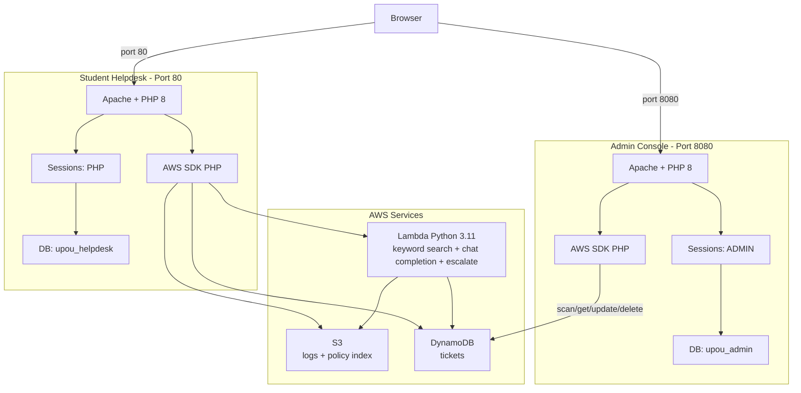

# Long Deployment — UPOU AI HelpDesk

**Time:** 30–45 minutes
**Audience:** First-time deployer, anyone wanting to understand each step

This guide explains *why* each step exists. For just the commands without explanations, see [`DEPLOYMENT-FAST.md`](DEPLOYMENT-FAST.md).

---

## Table of contents

1. [Architecture overview](#1-architecture-overview)
2. [Prerequisites and pre-flight checks](#2-prerequisites)
3. [Phase A — AWS resources via console](#3-phase-a--aws-resources)
4. [Phase B — Build the policy index](#4-phase-b--policy-index)
5. [Phase C — Launch and prepare EC2](#5-phase-c--ec2)
6. [Phase D — Install LAMP stack](#6-phase-d--lamp)
7. [Phase E — Deploy the student helpdesk](#7-phase-e--helpdesk)
8. [Phase F — Deploy the admin console](#8-phase-f--admin)
9. [Phase G — Build and upload the Lambda](#9-phase-g--lambda)
10. [Phase H — Verify end-to-end](#10-phase-h--verify)
11. [Phase I — SSL Certificate Setup (Optional)](#11-phase-i--ssl-certificate-setup-optional)
12. [Restart procedure for new sessions](#12-restart)
13. [Troubleshooting](#13-troubleshooting)

---

## 1. Logical Architecture



**Key design points:**

- **DynamoDB is the single source of truth for tickets.** The Lambda creates them on escalation, the admin console reads/updates them. No copies, no sync issues.
- **Two PHP apps, one Apache, two databases.** They share the same EC2 instance but have separate document roots, separate databases, and separate session cookie names so they can't interfere with each other.
- **Keyword search instead of vector embeddings.** Earlier versions used OpenAI embeddings, but the UPOU class proxy doesn't allow embedding generation. Keyword search works entirely with chat-only proxies and gives ~95% accuracy on the UPOU policy dataset.
- **First admin signup = admin** in the admin console. There's no manual seeding — whoever registers first gets the admin role automatically.

## 2. Prerequisites

### What you need before starting

- AWS Academy Learner Lab access (account, Start Lab button)
- An OpenAI-compatible API key — either real OpenAI or the UPOU class proxy at `https://is215-openai.upou.io/v1`
- The project source in a Git repo you can clone from EC2
- An SSH client on your laptop
- A web browser

### Pre-flight checklist

Run through this before you start. Each item prevents a specific class of bugs.

- [ ] Lab status dot is **green** (you're in an active lab session)
- [ ] AWS Console region (top right) is **N. Virginia (us-east-1)**
- [ ] You have a globally unique S3 bucket name picked out — **without** the `s3://` prefix
- [ ] Your OpenAI key works (test with `curl https://is215-openai.upou.io/v1/chat/completions -H "Authorization: Bearer YOUR_KEY" ...` from a shell)
- [ ] Your Git repo URL is committed and pushed
- [ ] You understand that your home IP may need to be re-allowed in the security group if you SSH from a different network later

## 3. Phase A — AWS resources via console

You have two options for this phase:

**Option A1 (recommended):** Use the `bootstrap_aws.sh` script in CloudShell. Creates everything in 30 seconds. See [`DEPLOYMENT-FAST.md`](DEPLOYMENT-FAST.md) Step 1.

**Option A2:** Click through the console manually for educational purposes. Continue here.

### A2.1 — Create the S3 bucket

1. Console search → **S3** → **Create bucket**
2. **Bucket name:** something globally unique like `upou-helpdesk-2026-yourinitials`
   - ⚠️ **Globally unique** means no one else in any AWS account can have used this name
   - ⚠️ Use only lowercase, digits, hyphens
   - ⚠️ Do NOT include `s3://` — that's a URL scheme, not part of the name
3. **Region:** US East (N. Virginia) us-east-1
4. **Block all public access:** leave checked
5. Leave everything else default → **Create bucket**

Write the bucket name down — you'll need it 4 more times.

### A2.2 — Create the DynamoDB table

1. Console search → **DynamoDB** → **Create table**
2. **Table name:** `upou-helpdesk-tickets`
3. **Partition key:** `ticket_id` (String)
4. **Table settings → Customize → Capacity mode → On-demand** (cheaper for low traffic, no capacity planning)
5. Leave defaults → **Create table**
6. Wait until status is **Active** (~30 seconds)

### A2.3 — Create the Lambda function

1. Console → **Lambda** → **Create function** → **Author from scratch**
2. **Function name:** `ai-webapp-handler`
3. **Runtime:** **Python 3.11** ⚠️
   - The dropdown defaults to the newest Python (3.13 or 3.14). **Do not accept the default.** Click and change to 3.11.
   - Why: pre-built wheels for `pydantic_core` (a transitive dep of openai) target older Python versions. Lambda 3.14 cannot load a wheel built for 3.11 — you'll see `Runtime.ImportModuleError` at every invocation.
4. **Architecture:** x86_64
5. Expand **Change default execution role** → **Use an existing role** → **`LabRole`**
6. Click **Create function**

### A2.4 — Set Lambda environment variables

After creation:

1. **Configuration** tab → **Environment variables** → **Edit** → **Add environment variable**
2. Add these:

| Key | Value |
|---|---|
| `OPENAI_API_KEY` | your real key (no placeholder text!) |
| `OPENAI_BASE_URL` | `https://is215-openai.upou.io/v1` (the BASE only — no `/chat/completions` suffix) |
| `OPENAI_MODEL` | `gpt-4o-mini` |
| `S3_BUCKET` | the bucket name (no `s3://` prefix) |
| `S3_PREFIX` | `logs/` |
| `POLICY_INDEX_KEY` | `policy_index.json` |
| `DDB_TICKETS_TABLE` | `upou-helpdesk-tickets` |
| `KEYWORD_THRESHOLD` | `0.15` |

3. **Save**

### A2.5 — Bump Lambda timeout and memory

1. **Configuration → General configuration → Edit**
2. **Timeout:** 30 sec
3. **Memory:** 512 MB
4. **Save**

The default timeout (3 sec) is not enough for OpenAI calls. The default memory (128 MB) can OOM when loading the policy index.

## 4. Phase B — Policy index

The Lambda reads `policy_index.json` from S3 on cold start. We need to build it from `data/policies.csv` and upload it before the Lambda will work.

In CloudShell or your laptop with AWS CLI:

```bash
git clone <YOUR_REPO_URL> upou-helpdesk
cd upou-helpdesk

pip3 install --user boto3   # only boto3 — no openai needed since we don't call it

export S3_BUCKET='your-bucket-name'   # no s3:// prefix
python3 scripts/build_policy_index.py
```

You should see:
```
Reading data/policies.csv...
  53 non-empty rows
Building keyword tokens for each chunk...
Uploading to s3://your-bucket-name/policy_index.json ...
Done. Index size: ~40 KB
```

Verify it's actually in S3:
```bash
aws s3 ls s3://$S3_BUCKET/policy_index.json
```

## 5. Phase C — EC2

### C.1 — Create a key pair

1. EC2 → **Key Pairs** → **Create key pair**
2. Name: `upou-helpdesk-key`
3. RSA, .pem format
4. **Create** — file downloads automatically
5. On Mac/Linux: `chmod 400 ~/Downloads/upou-helpdesk-key.pem`

### C.2 — Launch the instance

1. EC2 → **Launch instance**
2. **Name:** `upou-helpdesk`
3. **AMI:** Amazon Linux 2023
4. **Instance type:** **t3.small**
   - ⚠️ NOT t3.micro. Composer (the PHP package manager) needs ~1.5 GB RAM and t3.micro will OOM during install.
5. **Key pair:** `upou-helpdesk-key`
6. **Network → Edit** → Create security group `upou-helpdesk-sg`:
   - SSH (22) — Source: My IP
   - HTTP (80) — Source: My IP
   - HTTPS (443) — Source: Anywhere IPv4 (for SSL)
   - Custom TCP, Port 8080 — Source: My IP
   - Custom TCP, Port 8443 — Source: Anywhere IPv4 (for admin SSL)
7. **Advanced details** (scroll down) → **IAM instance profile** → **`LabInstanceProfile`**
   - This grants the EC2 instance permission to invoke Lambda, read S3, and read/write DynamoDB. No AWS access keys ever touch the instance.
8. **Launch**

### C.3 — Get the public IP

1. EC2 → Instances → click your `upou-helpdesk` instance
2. Copy **Public IPv4 address**

Wait ~60 seconds before SSHing.

## 6. Phase D — LAMP

### D.1 — SSH in
```bash
ssh -i ~/Downloads/upou-helpdesk-key.pem ec2-user@<PUBLIC_IP>
```

### D.2 — Install everything

```bash
sudo dnf update -y
sudo dnf install -y \
  httpd \
  php php-cli php-mysqlnd php-xml php-mbstring php-curl php-json \
  mariadb105-server \
  python3.11 python3.11-pip \
  git unzip zip policycoreutils-python-utils
```

What each package does:
- `httpd` — Apache 2.4 web server
- `php php-*` — PHP 8 with the extensions PHP needs (mysqli, xml, mbstring, curl, json)
- `mariadb105-server` — MariaDB 10.5 (MySQL-compatible)
- `python3.11 python3.11-pip` — Python 3.11 to match the Lambda runtime
- `git unzip zip` — for cloning the repo and building the Lambda zip
- `policycoreutils-python-utils` — provides `semanage` for SELinux port management

### D.3 — Install Composer (PHP package manager)
```bash
curl -sS https://getcomposer.org/installer | php
sudo mv composer.phar /usr/local/bin/composer
composer --version    # verify
```

### D.4 — Start services
```bash
sudo systemctl enable --now httpd mariadb
```

### D.5 — Install Python libraries system-wide
```bash
sudo pip3.11 install --quiet openai boto3
python3.11 -c "import boto3, openai; print('OK')"
```

If you see `OK`, the libraries are installed. If you get `ModuleNotFoundError`, the install went somewhere `python3.11` can't find — try `sudo pip3.11 install --break-system-packages openai boto3`.

### D.6 — SELinux: allow Apache on port 8080

Amazon Linux 2023 has SELinux enabled. By default Apache can only listen on port 80 and 443. The admin console runs on 8080, so we need to register that port:

```bash
sudo semanage port -a -t http_port_t -p tcp 8080
```

(If `semanage` says the port is already registered, that's fine.)

### D.7 — Secure MariaDB
```bash
sudo mysql_secure_installation
```

- Set root password: **Y**, type a strong one twice
- Remove anonymous users: **Y**
- Disallow root login remotely: **Y**
- Remove test database: **Y**
- Reload privilege tables: **Y**

## 7. Phase E — Helpdesk

### E.1 — Clone the project

```bash
sudo mkdir -p /var/www
sudo chown ec2-user:ec2-user /var/www
cd /var/www
git clone <YOUR_REPO_URL> upou-helpdesk
cd upou-helpdesk
ls
```

You should see: `data docs lambda php admin scripts sql README.md` etc.

If you see a nested `upou-helpdesk/upou-helpdesk` directory (a git quirk), flatten it:
```bash
cd /var/www
sudo mv upou-helpdesk/upou-helpdesk /tmp/helpdesk-tmp
sudo rm -rf upou-helpdesk
sudo mv /tmp/helpdesk-tmp upou-helpdesk
sudo chown -R ec2-user:ec2-user upou-helpdesk
cd upou-helpdesk
```

### E.2 — Install PHP dependencies

```bash
cd /var/www/upou-helpdesk/php
composer install --no-dev --optimize-autoloader
```

Wait ~2 minutes. This downloads `aws/aws-sdk-php` and its dependencies into `vendor/`. If you get an OOM error, your instance is t3.micro — relaunch as t3.small.

### E.3 — Set up the helpdesk database

Generate a strong DB password and substitute it into the schema:

```bash
DB_PASS=$(openssl rand -base64 16 | tr -d '=+/')
echo "Helpdesk DB password (write this down): $DB_PASS"

sed -i "s/CHANGE_ME_STRONG_PASSWORD/$DB_PASS/" /var/www/upou-helpdesk/sql/schema.sql

sudo mysql -u root -p < /var/www/upou-helpdesk/sql/schema.sql
```

Enter the MariaDB root password when prompted.

Verify:
```bash
mysql -u upou_app -p upou_helpdesk -e "SHOW TABLES;"
```

You should see `users` and `chat_history`.

### E.4 — Configure Apache vhost for the helpdesk

```bash
sudo cp /var/www/upou-helpdesk/docs/deploy/upou-helpdesk.conf /etc/httpd/conf.d/

# Substitute your bucket and DB password into the vhost
sudo sed -i "s|your-bucket-name-here|YOUR_BUCKET_NAME|" /etc/httpd/conf.d/upou-helpdesk.conf
sudo sed -i "s|CHANGE_ME_STRONG_PASSWORD|$DB_PASS|" /etc/httpd/conf.d/upou-helpdesk.conf
```

Replace `YOUR_BUCKET_NAME` with the real one.

Disable the default Apache welcome page:
```bash
sudo rm -f /etc/httpd/conf.d/welcome.conf
```

Set permissions and reload:
```bash
sudo chown -R apache:apache /var/www/upou-helpdesk/php
sudo apachectl configtest
sudo systemctl restart httpd
```

### E.5 — Smoke test

From your laptop:
```
http://<EC2_PUBLIC_IP>/
```

You should see the UPOU AI HelpDesk landing page. Click **Sign up**, register, and verify you can land on the chat page. **Do not try to ask a question yet** — the Lambda doesn't have code yet.

## 8. Phase F — Admin

Same pattern as Phase E but for the admin app.

```bash
cd /var/www/upou-helpdesk/admin
composer install --no-dev --optimize-autoloader

ADMIN_DB_PASS=$(openssl rand -base64 16 | tr -d '=+/')
echo "Admin DB password (write this down): $ADMIN_DB_PASS"
sed -i "s/CHANGE_ME_STRONG_PASSWORD/$ADMIN_DB_PASS/" /var/www/upou-helpdesk/admin/sql/schema.sql
sudo mysql -u root -p < /var/www/upou-helpdesk/admin/sql/schema.sql

sudo cp /var/www/upou-helpdesk/admin/docs/upou-admin.conf /etc/httpd/conf.d/
sudo sed -i "s|CHANGE_ME_STRONG_PASSWORD|$ADMIN_DB_PASS|" /etc/httpd/conf.d/upou-admin.conf

sudo chown -R apache:apache /var/www/upou-helpdesk/admin
sudo apachectl configtest
sudo systemctl restart httpd

# Verify port 8080 is now listening
sudo ss -tlnp | grep ':8080'
```

Visit `http://<EC2_PUBLIC_IP>:8080/`. You should see the admin login page. Sign up — the registration page should say *"You will be the first admin"*. After signup you land on the dashboard with all-zero counts.

## 9. Phase G — Lambda

The Lambda function shell already exists (created in Phase A). Now we build and upload the actual code.

```bash
cd /var/www/upou-helpdesk
chmod +x scripts/*.sh
./scripts/deploy_lambda.sh
```

This script:
1. Verifies prerequisites (`pip3.11`, `aws`, `zip`)
2. Sanity-checks `lambda/lambda_function.py` is actually Python (catches the case where the file got overwritten by something else)
3. Cross-installs `openai` for `manylinux2014_x86_64` + cpython 3.11 (the Lambda runtime ABI)
4. Verifies the compiled `pydantic_core` `.so` matches Linux x86_64 + Python 3.11
5. Builds the zip with `lambda_function.py` at the root
6. Verifies the zip structure (no nested folder)
7. **Re-pins the Lambda runtime to `python3.11`** before uploading (prevents the runtime-drift bug)
8. Bumps memory to 512 MB if it's lower
9. Uploads the zip via `aws lambda update-function-code`
10. Waits for `LastUpdateStatus = Successful`
11. Smoke-tests by invoking the Lambda

Expected output ends with:
```
✓ Smoke test passed
=== Deploy complete ===
```

If the smoke test fails, the script exits with the actual error. The error message is the next thing to debug.

### G.1 — Manual environment variable fix (known issue)

The bootstrap script may have issues with special characters in environment variables. Manually configure the `OPENAI_BASE_URL` in the Lambda console:

1. Lambda → `ai-webapp-handler` → **Configuration** tab → **Environment variables** → **Edit**
2. Add or update:
   - **Key:** `OPENAI_BASE_URL`
   - **Value:** `https://is215-openai.upou.io/v1`
3. **Save**

### G.2 — Run the deploy orchestrator

After the Lambda is deployed, run the orchestrator to upload the policy index and verify everything:

```bash
cd /var/www/upou-helpdesk
export OPENAI_API_KEY='your-key'
export OPENAI_BASE_URL='https://is215-openai.upou.io/v1'
export S3_BUCKET='your-bucket-name'

./scripts/deploy_all.sh
```

This builds the policy index, uploads it to S3, and runs end-to-end verification.

### G.3 — Fix admin console port 8080 issues

Run the diagnostic script to fix any Apache vhost issues on port 8080:

```bash
./scripts/diagnose-admin-8080.sh
```

This script checks for common issues (SELinux, DocumentRoot paths, Apache config) and applies fixes automatically.

## 10. Phase H — Verify

### H.1 — Lambda direct test

In the Lambda console, click **Test** tab → Create new test event with this JSON:

```json
{"question": "When does 2nd semester 2025-2026 start?"}
```

Click **Test**. The response should look like:

```json
{
  "statusCode": 200,
  "body": "{\"id\":\"...\",\"answer\":\"The 2nd semester for AY 2025-2026 starts on 26 January 2026 (Monday)...\",\"source_label\":\"Official Policy\",\"sources\":[{\"chunk_id\":\"CAL002\",...}],...}"
}
```

If you see this, the Lambda + keyword search + chat completion + S3 logging are all working.

### H.2 — Student app end-to-end

Browser → `http://<EC2_PUBLIC_IP>/`:
1. Log in
2. Ask: *"When does 2nd semester 2025-2026 start?"* → 🟢 Official Policy badge
3. Ask: *"Who wrote Hamlet?"* → 🟡 General Knowledge badge
4. Ask: *"What's my GPA in BIO101?"* → 🔴 Forwarded to Human Agent badge with a ticket ID
5. Visit `/history.php` → all three appear

### H.3 — Admin app end-to-end

Browser → `http://<EC2_PUBLIC_IP>:8080/`:
1. Log in (you should already be the admin from Phase F)
2. Dashboard → ticket count is **1** (the GPA escalation from H.2)
3. Click the ticket → review the AI's attempt → click **Claim** → status becomes IN_PROGRESS
4. Add resolution notes → change status to RESOLVED → Save
5. Verify in DynamoDB:
   ```bash
   aws dynamodb scan --table-name upou-helpdesk-tickets --region us-east-1 \
     --query 'Items[*].{id:ticket_id.S,status:status.S,assignee:assignee.S,resolved:resolved_at.S}' \
     --output table
   ```
   Should show your ticket with the new fields populated.

### H.4 — Storage layer checks

```bash
# S3 — should have policy_index.json + log files
aws s3 ls s3://$S3_BUCKET/
aws s3 ls s3://$S3_BUCKET/logs/ --recursive | head -5

# MySQL — chat_history rows
mysql -u upou_app -p upou_helpdesk -e "SELECT id, source_label, LEFT(question,50) AS q FROM chat_history ORDER BY id DESC LIMIT 5;"

# DynamoDB — tickets
aws dynamodb scan --table-name upou-helpdesk-tickets --region us-east-1 --output table | head -20
```

If all three storage layers have data, deployment is complete.

## 11. Phase I — SSL Certificate Setup (Optional)

If you want to enable HTTPS for the student portal (port 443) and admin console (port 8443), follow these steps.

### I.1 — Generate a placeholder SSL certificate

Amazon Linux ships with `ssl.conf` referencing a certificate that doesn't exist. Generate a placeholder so Apache can start:

```bash
sudo openssl req -x509 -nodes -days 365 \
  -newkey rsa:2048 \
  -keyout /etc/pki/tls/private/localhost.key \
  -out /etc/pki/tls/certs/localhost.crt \
  -subj "/CN=localhost"
```

### I.2 — Upload SSL certificate backup

If you have an existing SSL certificate backup (e.g., from a previous deployment), upload it to the EC2 instance.

**From your laptop:**

Windows (PowerShell or CMD):
```bash
scp -i C:\Users\YourName\Downloads\upou-helpdesk-key.pem ^
  C:\Users\YourName\Downloads\upou-ssl-backup.tar.gz ^
  ec2-user@<EC2_PUBLIC_IP>:/tmp/
```

Mac / Linux (Terminal):
```bash
scp -i ~/Downloads/upou-helpdesk-key.pem \
  ~/Downloads/upou-ssl-backup.tar.gz \
  ec2-user@<EC2_PUBLIC_IP>:/tmp/
```

**On EC2, verify upload:**
```bash
ls -lh /tmp/upou-ssl-backup.tar.gz
```

Expected output: `-rw-r--r-- 1 ec2-user ec2-user 45K [date] /tmp/upou-ssl-backup.tar.gz`

### I.3 — Import the SSL certificate

```bash
cd /var/www/upou-helpdesk
sudo ./scripts/ssl.sh import
```

This script detects the uploaded certificate in common locations and restores it to the correct paths.

### I.4 — Verify SSL is working

```bash
curl -sk https://upouaihelp.duckdns.org/
curl -sk https://upouaihelp.duckdns.org:8443/
```

If both commands return HTML content without errors, SSL is configured correctly.

### I.5 — Alternative: Obtain new SSL certificate

If you don't have a backup and want to obtain a new SSL certificate from Let's Encrypt:

```bash
cd /var/www/upou-helpdesk
sudo ./scripts/ssl.sh setup
```

This will:
- Install certbot if not present
- Obtain certificates for your domains
- Configure Apache HTTPS vhosts
- Set up auto-renewal

The script supports multiple domains (configured at the top of `ssl.sh`).

## 12. Restart

See [`DEPLOYMENT-FAST.md`](DEPLOYMENT-FAST.md) "Restarting after a Learner Lab session expires." Same procedure — Apache and MariaDB auto-start, you just need to update the security group's My IP rule.

## 13. Troubleshooting

See [`KNOWN-ISSUES.md`](KNOWN-ISSUES.md) for the full catalog. Top three by frequency:

1. **Lambda returns `pydantic_core` import error** → runtime drifted to 3.14. Fix: Lambda console → Code tab → Runtime settings → set to Python 3.11. Or re-run `./scripts/deploy_lambda.sh` (it pins the runtime automatically).

2. **PHP returns "Unexpected end of JSON input"** → PHP fatal error. Check `/var/log/php-fpm/www-error.log` (NOT `upou-helpdesk-error.log` — fatals don't go there).

3. **Lambda escalates everything** → cached old policy index. Re-run `./scripts/deploy_policy_index.sh` (it bumps `CACHE_BUST` to force cold start).

For any other issue, the deploy scripts have detailed `✗` error messages telling you exactly what failed.
