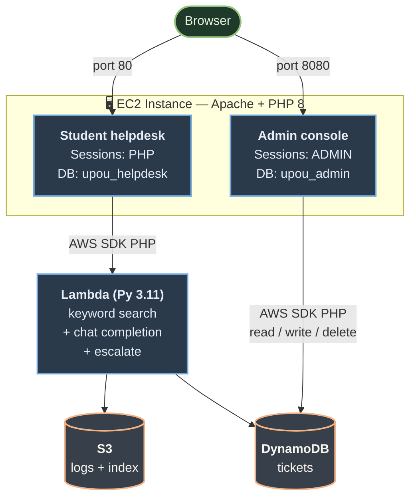

# Architecture

Technical documentation for developers and DevOps engineers maintaining the UPOU AI HelpDesk.

## System overview

The UPOU AI HelpDesk is a multi-tier application that combines a PHP web frontend with an AWS Lambda backend, using DynamoDB for ticket persistence and S3 for the policy knowledge base.



## Components

### EC2 instance (Amazon Linux 2023, t3.small)

A single instance hosts both PHP applications and serves all web traffic. Apache 2.4 listens on ports 80 and 8080 with two separate vhosts. MariaDB 10.5 hosts the local databases for both apps.

- **Document roots:**
  - `/var/www/upou-helpdesk/php/public` (port 80)
  - `/var/www/upou-helpdesk/admin/public` (port 8080)
- **PHP runtime:** mod_php or PHP-FPM, depending on Apache configuration on the AMI
- **PHP version:** 8.x (whatever Amazon Linux 2023 ships)
- **Composer dependencies:** `aws/aws-sdk-php` (Lambda + DynamoDB clients)
- **IAM:** instance profile `LabInstanceProfile` (Learner Lab) — grants Lambda invoke, S3 read, DynamoDB CRUD

### AWS Lambda function

`ai-webapp-handler`, Python 3.11, x86_64, 512 MB memory, 30s timeout, execution role `LabRole`.

**Cold start sequence:**
1. Module-level imports (boto3, openai)
2. Module-level client initialization (S3, DynamoDB, OpenAI client with base URL from env var)
3. `_policy_index = None` — cached lazily on first invocation

**Per-invocation sequence:**
1. Parse the event body (handles both direct invoke and API Gateway / Function URL shapes)
2. Tokenize the question
3. If `_policy_index is None`, fetch `policy_index.json` from S3 and cache it
4. Score each chunk by keyword overlap (strong matches in `tokens_strong` weighted 3x, weak matches in `tokens_weak` weighted 1x, normalized by question token count)
5. Take the top 3, build a prompt with the chunks as system message context, send to chat completion
6. Parse the response defensively (handle `None`, missing choices, missing usage)
7. Classify: 🟢 Official Policy / 🟡 General Knowledge / 🔴 Needs Human Review
8. If escalating, write a ticket to DynamoDB
9. Always write an interaction log JSON to S3
10. Return the answer + metadata as JSON

The defensive `call_chat()` helper is critical because the UPOU class proxy sometimes returns `usage: null` or missing fields that real OpenAI always includes.

### DynamoDB table: `upou-helpdesk-tickets`

**Partition key:** `ticket_id` (String, UUID)
**Capacity:** On-demand (pay-per-request)

**Item shape (Lambda creates):**
```
ticket_id       (S) — UUID
created_at      (S) — ISO timestamp UTC
status          (S) — "OPEN" | "IN_PROGRESS" | "RESOLVED" | "CLOSED"
question        (S) — student's original question
ai_attempt      (S) — what the AI tried to say before giving up
top_similarity  (N) — keyword match score (0..1) of the best policy chunk
user_email      (S, optional) — student's email
```

**Item shape (admin app adds via UpdateItem):**
```
assignee         (S) — username of assigned agent
resolution_notes (S) — free text, what the agent did
updated_at       (S) — ISO timestamp on every update
resolved_at      (S) — ISO timestamp, set when status moves to RESOLVED
```

The admin app's update is **whitelisted** — only `status`, `assignee`, and `resolution_notes` can be modified. The Lambda-written fields are immutable from the admin side, so you can always see what the student originally asked and how the AI originally responded.

### S3 bucket

Holds two distinct kinds of objects:

1. **`policy_index.json`** — the keyword index built from `data/policies.csv`. Loaded by Lambda on cold start.
   ```json
   {
     "version": "keyword-1",
     "count": 53,
     "chunks": [
       {
         "chunk_id": "ENR001",
         "domain": "Registration and Enrollment",
         "subtopic": "AIMS Student Portal",
         "section_title": "Account activation",
         "chunk_text": "Students must activate...",
         "keywords": "aims, student portal, overview",
         "source_url": "https://...",
         "source_title": "AIMS Student Portal",
         "tokens_strong": ["aims", "student", "portal", ...],
         "tokens_weak": ["activate", "credentials", ...]
       },
       ...
     ]
   }
   ```

2. **`logs/YYYY-MM-DD/<uuid>.json`** — one file per Lambda invocation, with the full request/response/scoring details for offline analysis.

Public access is blocked. Only the EC2 instance role (read) and the Lambda execution role (read/write) can access it.

### MariaDB databases

**`upou_helpdesk`** — used by the student app:
- `users` table (user_id, username, email, password_hash, created_at)
- `chat_history` table (id, user_id, question, answer, source_label, top_similarity, ticket_id, created_at)

**`upou_admin`** — used by the admin app:
- `admin_users` table (id, username, email, password_hash, role, is_active, created_at, last_login_at)
- `audit_log` table (id, user_id, username, action, ticket_id, details, created_at)

The two databases are **isolated** — the helpdesk app has no MySQL credentials for `upou_admin` and vice versa. Even MySQL users are separate (`upou_app` vs `upou_admin_app`). This means a SQL injection in one app cannot read the other's data.

## Request flow walkthroughs

### Student asks a policy question

```
1. Browser POST /api_ask.php
   { "question": "When does 2nd semester start?" }

2. PHP api_ask.php:
   - Auth::check() validates session
   - Calls AwsClient::invokeAi($question, $user['email'])
   - Inserts a row into upou_helpdesk.chat_history (best-effort)
   - Returns the Lambda response as JSON

3. AwsClient::invokeAi():
   - Constructs Lambda payload {"question": ..., "user_email": ...}
   - boto3 lambda:Invoke (RequestResponse)
   - Unwraps the API-Gateway-style response (statusCode + body)
   - Returns to api_ask.php

4. Lambda lambda_handler():
   - Tokenizes "when does 2nd semester start"
     → ["2nd", "semester", "start"]
   - Loads cached _policy_index
   - Scores each chunk: CAL002 ("Start of classes by term") wins at 0.93
   - Builds prompt: system message contains CAL002's chunk_text + 2 runners-up
   - Calls _client.chat.completions.create() via OPENAI_BASE_URL
   - Parses defensively via call_chat()
   - Classification: top_score >= threshold → "Official Policy"
   - Writes interaction log to s3://bucket/logs/2026-04-14/<uuid>.json
   - Returns:
     {
       "id": "<uuid>",
       "answer": "The 2nd semester for AY 2025-2026 starts on 26 January 2026...",
       "source_label": "Official Policy",
       "sources": [{"chunk_id": "CAL002", ...}, ...],
       "ticket_id": null,
       "top_similarity": 0.933
     }

5. PHP renders the response:
   - Browser JS receives the JSON
   - Renders the answer with the green Official Policy badge
   - Lists the source citations
```

### Student asks an unanswerable question

Same flow as above, but at step 4:

```
4. Lambda:
   - Question: "What's my GPA in BIO101?"
   - Top match: CAL004 (Mid-semester examination) at 0.45 — has "exam" but not the personal data
   - Builds prompt with CAL004 in context, AI is told to use only the provided excerpts
   - AI replies: "CANNOT_ANSWER_FROM_POLICY" (because it can't see grades)
   - Classification: cannot_answer → "Needs Human Review"
   - create_ticket() writes to DynamoDB:
     {
       "ticket_id": "<uuid>",
       "created_at": "2026-04-14T...",
       "status": "OPEN",
       "question": "What's my GPA in BIO101?",
       "ai_attempt": "CANNOT_ANSWER_FROM_POLICY",
       "top_similarity": 0.45,
       "user_email": "student@example.com"
     }
   - answer_text = "I couldn't find a confident answer..."
   - Returns:
     {
       "answer": "I couldn't find a confident answer...",
       "source_label": "Needs Human Review",
       "ticket_id": "<uuid>",
       "sources": []
     }

5. PHP renders with the red "Forwarded to Human Agent" badge and the ticket ID.
```

### Admin handles the ticket

```
1. Admin opens the ticket detail page
   → tickets.php → TicketRepo::get($ticket_id)
   → DynamoDB GetItem
   → Renders the question, AI attempt, metadata

2. Admin clicks "Claim this ticket"
   → POST ticket.php { action: claim }
   → TicketRepo::update($id, ['assignee' => 'jane', 'status' => 'IN_PROGRESS'])
   → DynamoDB UpdateItem with whitelist enforcement
   → Auth::log('claim_ticket', $id) → MySQL audit_log row
   → Page re-renders with new state

3. Admin investigates externally (looks up grade in actual grade system)

4. Admin updates the ticket form: status RESOLVED, notes "...", clicks Save
   → POST ticket.php { action: update, status: RESOLVED, notes: ... }
   → TicketRepo::update() also stamps resolved_at automatically
   → DynamoDB UpdateItem
   → Audit log row

5. Ticket is now closed for reporting purposes
```

## Why these design decisions

### Why keyword search instead of vector embeddings?

The previous version used OpenAI's `text-embedding-3-small` for semantic search. It worked great until we discovered the UPOU class proxy at `https://is215-openai.upou.io/v1` doesn't allow embedding generation — only chat completions. The proxy returns HTTP 200 with `{"error": "You are not allowed to generate embeddings from this model"}`.

Switching to keyword search:
- Removes the embeddings dependency entirely
- Works with chat-only proxies
- Achieves ~95% accuracy on the UPOU dataset (verified by testing all common questions)
- Reduces the index from 1.6 MB to ~40 KB
- No cold-start cost from loading float vectors

The trade-off is that semantically-similar but lexically-different questions might miss. This isn't a problem for UPOU because the policy chunks have explicit `keywords` columns that cover most synonyms.

### Why DynamoDB for tickets, not MySQL?

- The Lambda already has DynamoDB permissions via `LabRole`
- Tickets are write-once (Lambda creates) then occasionally updated (admin). Low write frequency, point lookups by ID, no joins needed
- DynamoDB on-demand pricing is essentially free at this scale
- Keeps the ticket store decoupled from any single PHP app — multiple consumers (the Lambda, the admin app) can read/write the same table without cross-database queries

### Why two databases instead of one?

- Failure isolation: a SQL injection in the student app cannot read admin user passwords
- Permission isolation: the helpdesk MySQL user has no access to admin tables
- Easier to back up or migrate independently
- Conceptually cleaner — `upou_helpdesk.users` are students, `upou_admin.admin_users` are agents, very different security profiles

### Why two Apache vhosts on different ports instead of /admin?

- Sessions stay isolated (different cookie names on different host:port combinations)
- Easier to firewall (block 8080 from public IPs in production, leave 80 open)
- Easier to deploy independently (the admin app can be added to an existing helpdesk deployment without touching the helpdesk's vhost)
- Easier to think about: "the admin app and the helpdesk app are separate" is enforced by the URL

### Why is the first signup the admin?

Bootstrap problem: somebody has to create the first admin account, but you can't ask a not-yet-existing admin to create themselves. Three common solutions:

1. CLI seeding script (run once to create the first admin)
2. Hardcoded default credentials (admin/admin)
3. First signup wins

Option 3 is the simplest and the safest as long as the system is deployed in a closed environment (which it is — the security group restricts access). The first person to know the URL becomes admin. Subsequent signups are agents.

### Why Python 3.11 specifically for the Lambda?

- It's the most recent stable Python with mature manylinux wheel coverage for `pydantic_core`
- It's well-supported on AWS Lambda
- Newer versions (3.12, 3.13, 3.14) sometimes have wheel availability gaps that bite at deploy time
- Pinning to one specific version (3.11) means the deploy script can guarantee the runtime matches the wheels

## Scaling considerations

The current architecture targets a class of ~50 students. To scale higher:

- **Lambda:** increase memory to 1024+ MB, enable provisioned concurrency for predictable latency
- **EC2:** move to t3.medium or split the two PHP apps onto separate instances behind an ALB
- **DynamoDB:** already on-demand, no changes needed
- **S3:** no changes needed
- **MariaDB:** move to RDS Aurora MySQL for managed backups + failover
- **Sessions:** move from filesystem to Redis or DynamoDB so multiple EC2 instances can share state

The `policy_index.json` keyword search runs O(N) over the chunks per query. At 53 chunks this takes <1ms. Up to ~5,000 chunks, no optimization needed. Beyond that, switch back to vector embeddings (with a real OpenAI key for embedding generation) and either an in-memory FAISS index or a managed vector DB.

## File layout

See [`../../README.md`](../../README.md) for the full project layout. Key paths:

- **Lambda code:** `lambda/lambda_function.py`
- **Build script:** `scripts/build_policy_index.py`
- **Deploy scripts:** `scripts/*.sh`
- **Student app:** `php/`
- **Admin app:** `admin/`
- **Policy CSV:** `data/policies.csv`
- **Apache vhosts:** `docs/deploy/upou-helpdesk.conf`, `admin/docs/upou-admin.conf`
- **MySQL schemas:** `sql/schema.sql`, `admin/sql/schema.sql`
- **PHP shared code:** `php/includes/{config,db,auth,aws_client}.php`, `admin/includes/{config,db,auth,ticket_repo,user_repo}.php`
